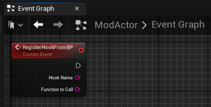
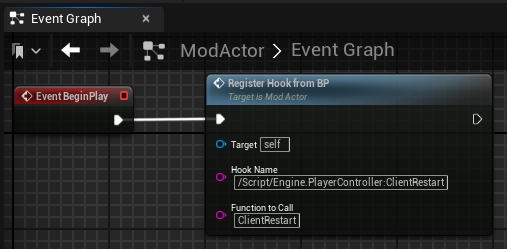
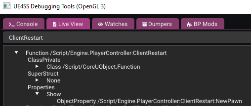
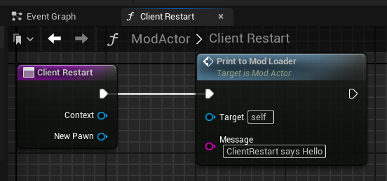

# RegisterHookFromBP

The custom `RegisterHookFromBP` function allows you to hook functions inside blueprints similar to [RegisterHook](../../lua-api/global-functions/registerhook.md) in Lua. Same rules apply.

Callbacks are triggered when a `UFunction` is executed.

The callback params are: `UObject Context`, `UFunctionParams..`.

> Any `UFunction` that you attempt to register with `RegisterHookFromBP` must already exist in memory when you register it.

## Parameters

| # | Type     | Information                                                                                                                                                         |
|---|----------|---------------------------------------------------------------------------------------------------------------------------------------------------------------------|
| 1 | FString   | Full name of the UFunction to hook. Type prefix has no effect.                                                                                                      |
| 2 | FString | Name of the callback function to execute after the UFunction is executed. |

## Example

1. Create a new Custom Event in your Actor's Event Graph called `RegisterHookFromBP` and add the following params to it:
     - HookName
     - FunctionToCall

2. Next we call the `RegisterHookFromBP` event we created earlier and for this example we'll be using `/Script/Engine.PlayerController:ClientRestart` as the hook function and our callback function will be called `ClientRestart` where we execute our logic whenever our hook is called.

Before we move on to the next step, let's create another custom event called `PrintToModLoader` which is provided by UE4SS and lets us print messages to the UE4SS console. This is completely optional, but we'll use it in this example for the sake of demonstration.

3. In the next step we'll create the function `ClientRestart` that acts as our callback function whenever our hook is triggered, but first let's figure out what params we need to match the original `/Script/Engine.PlayerController:ClientRestart` function by using LiveView.

We can see here that `/Script/Engine.PlayerController:ClientRestart` has a total of one param which is `NewPawn` with a type of `APawn` so in the editor it would be called `Pawn`.

4. Let's implement the `ClientRestart` function. In the image below we have a Context param and our `NewPawn` param.

`Context` param type is `PlayerController` since it's the owner of the function. 
`NewPawn` param type is `Pawn`. 

There are a couple rules to remember when using `RegisterHookFromBP`:
- Param count and types must match the original function