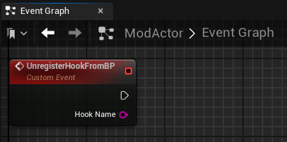
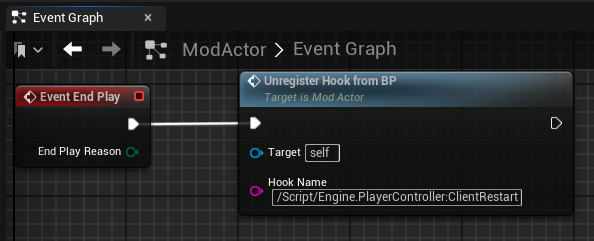

# UnregisterHookFromBP

The custom `UnregisterHookFromBP` function allows you to unregister hooks that were registered by `RegisterHookFromBP`.

## Parameters

| # | Type     | Information                                                                                                                                                         |
|---|----------|---------------------------------------------------------------------------------------------------------------------------------------------------------------------|
| 1 | FString   | Full name of the UFunction to hook. Type prefix has no effect.

## Example

1. Create a new Custom Event in your Actor's Event Graph called `UnregisterHookFromBP` and add the following param to it:
     - HookName

2. Now you can call the `UnregisterHookFromBP` event and we'll be using `/Script/Engine.PlayerController:ClientRestart` as the `HookName` to unregister the hook we created in the `RegisterHookFromBP` example.

