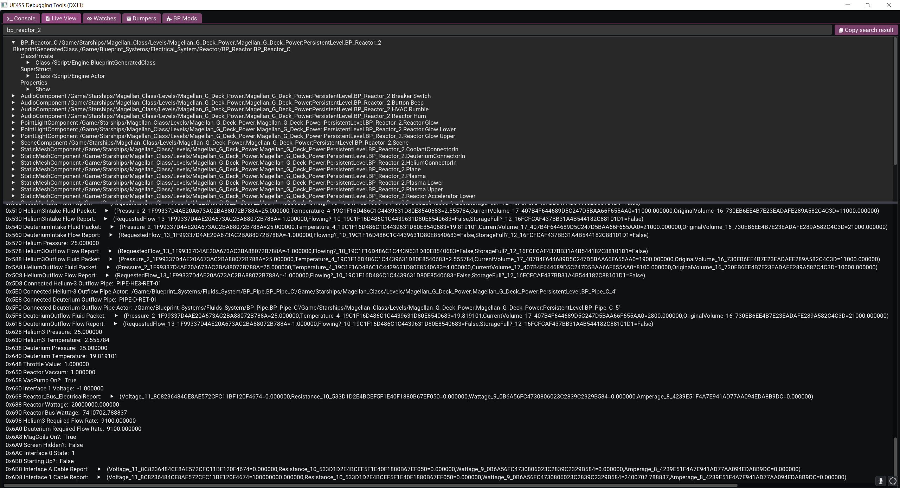
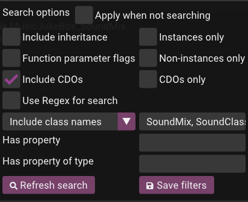
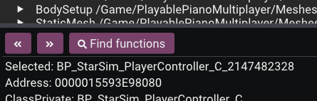
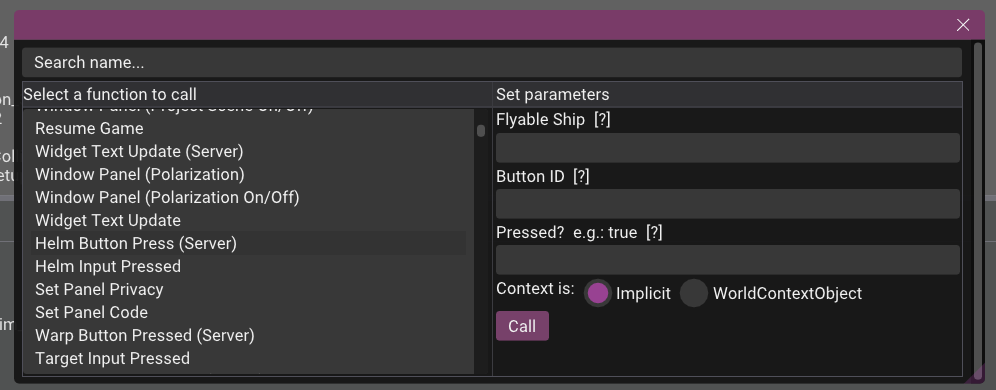
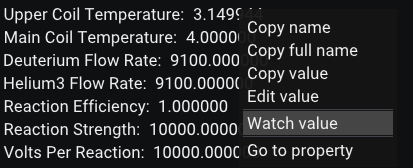
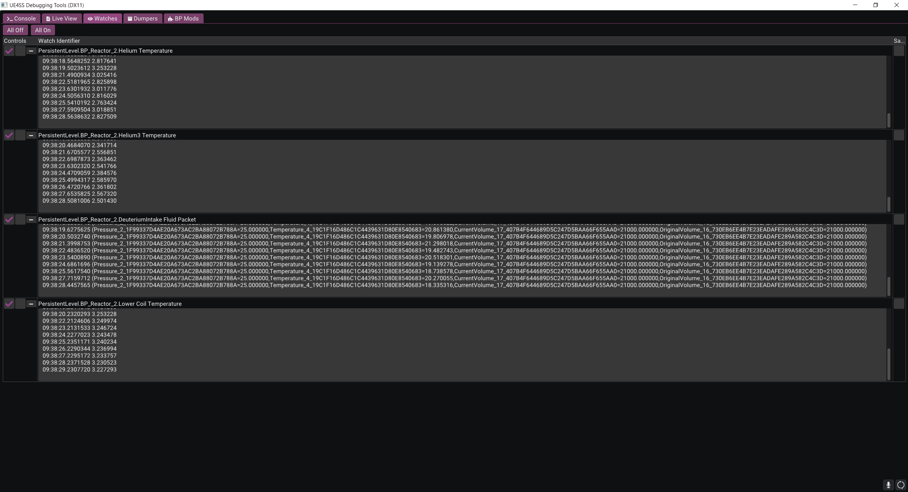
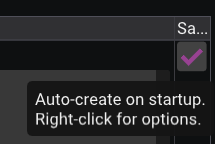
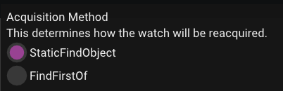

# Live Viewer

The Live Viewer is a tool that allows you to search, view, edit & watch the properties of every object making it very powerful for debugging mods or figuring out how values are changed during runtime. Note however that it cannot show unreflected data.

In order to see it, you must make sure that the following configuration settings are set to 1:
- `GuiConsoleEnabled`
- `GuiConsoleVisible`

**If you are having any issues seeing the window, for example if it opens as blanked out/white, you can change the `GraphicsAPI` setting, for example to `dx11`.**

Sometimes the font is too small to easily see (particularly on larger resolutions). You can edit the `GuiConsoleFontScaling` setting to change this.

You can right-click the search bar to show options.

| Setting                  | Explanation                                                                                                                                                                                                                      |
|--------------------------|----------------------------------------------------------------------------------------------------------------------------------------------------------------------------------------------------------------------------------|
| Refresh search           | Refreshes the search results.                                                                                                                                                                                                    |
| Save filters             | Saves the current search filters to `working directory/liveview/filters.meta.json`. Saved filters are loaded when the game is next launched.                                                                                    |
| Apply when not searching | Applies the filters while not searching for any objects by name.                                                                                                                                        |
| Include inheritance      | Includes any child objects of any search results.                                                                                                                                                                                |
| Instances only           | Only includes object instances. These are objects present in the level as part of actors (actors themselves, widgets, components etc.), and their properties are a reflection of the real-time values. Examples include `<package name>_C` or `<package name>_C_<some instance id>`. |
| Non-instances only       | Only includes the default state of object packages, which are loaded in memory but are not present in the level. You cannot change the values of these properties.                                                                                                                   |
| CDOs only                | Only includes the class default objects (CDOs), which are the reflected properties inherited by non-instances from a UClass object. Examples include `<full path>_GEN_VARIABLE` or `<package path>.Default__<package name>`.                                                         |
| Include CDOs             | Includes CDOs in any of your search criteria.                                                                                                                                                                                                                                        |
| Use Regex for search     | Allows you to use regex to make more specific searches.                                                                                                                                                                                                                              |
| Exclude class names      | Allows you to exclude specific class names, e.g., `CanvasPanelSlot` or `StaticMeshComponent`. Comma seperated list, e.g., `CanvasPanelSlot, StaticMeshComponent,Package , Function`.                                                                                                 | 
| Include class names      | Accessible by exclude class names dropdown. Allows you to include only specific class names, e.g., `CanvasPanelSlot` or `StaticMeshComponent`. Comma seperated list, e.g., `CanvasPanelSlot, StaticMeshComponent,Package , Function`.                                                |
| Has property             | Finds objects only if they have a property of a specific name, e.g., `Player Name`. This setting is applied only if you have entered any value in the search bar.                                                                                                                    |
| Has property type        | Finds objects only if they have a property of a specific type, such as `BoolProperty` or `MulticastInlineDelegateProperty`.                                                                                                                                                          |
| Function parameter flags | Clicking on this checkbox opens a new popup. Allows you to select any number of flags to filter functions by and whether or not you want it to use your selected flags to check for the return flag                                                                                  |

In the property viewer pane at the bottom, there are three sub-controls:
- `<<` which goes backwards through your history.
- `>>` which goes forwards through your history.
- `Find functions` which opens a window to search for and call any functions associated with this object and any of its children. You can use this to test calling functions in-game without having to write any code.

## Watches

You can right click most property types, and functions, to add a watch.

To view your watches, go into the watches tab. 

Click the plus buttons on the left of each watch to expand the values box.

On the left side of the watch, there are two checkboxes:
- Enable/disable watch
- Write the watch to a file. If this is enabled, when you close the game, the values from your watche will be saved as a text file in `working directory/watches/`.

On the right side of the watch, there is an option to save the watch which will be automatically re-added when you restart the game. This data is stored inside of `working directory/watches/watches.meta.json`

