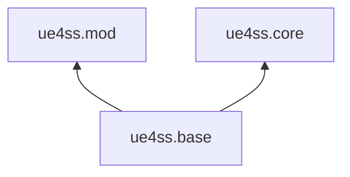
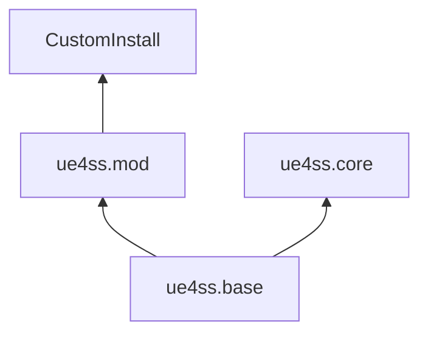

# Advanced C++ Modding Handbook

## xmake Customization

We provide an `xmake` rule in order to facilitate easy mod setup. The simplest mod `xmake.lua` file looks something like this:

```lua
 target("SimpleMod")
   add_rules("ue4ss.mod") -- Adding this rule gives you all the built-in goodies!
   add_includeirs(".")
   add_files("dllmain.cpp")
```

>[!IMPORTANT] What does `ue4ss.mod` get me?
> Adding the `ue4ss.mod` rule is equivalent to  
>
>```lua
> target("DefaultMod")
>   set_kind("shared") -- Builds your mod as a DLL.
>   set_languages("cxx20") -- Builds your mod with /std:c++20
>   set_exceptions("cxx") -- Compiler agnostic exception flag
>   set_group("mods")
>   add_deps("UE4SS")
>
>   -- ue4ss.base is critical for xmake to understand the imports/exports/modes of UE4SS
>   add_rules("ue4ss.base") 
>   
>   on_install(function(target) 
>       -- Calls the install lua function located at
>       -- UE4SS/tools/xmakescripts/modules/mods/install.lua
>       import("mods.install").install(target)
>   end)
>```

You can easily override any of these settings by specifying them in your target.

```lua
target("CustomMod")
    add_rules("ue4ss.mod") -- Inherit built-in goodies!
    set_languages("cxxlatest") -- Override the goodies!
```

> [!WARNING] When in doubt...
> You'll almost always want to add the `ue4ss.mod` rule. At the bare minimum, your mod *MUST* have `add_rules("ue4ss.base")`. Conveniently, the `u4ss.mod` rule automatically adds the `ue4ss.base` rule, so you don't need to worry about adding both.
>
>```lua
> target("BadMod")
>   add_rules("ue4ss.mod")
>   -- Adding the ue4ss.base rule is redundant here since ue4ss.mod already adds the base rule!
>   add_rules("ue4ss.base")
>```

### xmake Rules

[xmake Rule Documentation](https://xmake.io/#/manual/custom_rule)

Rules are a powerful way to share configuration, logic, and scripting while building your mods. Rules can depend on other rules and conversely be depended on by other rules.

#### Rule dependencies

The built-in UE4SS rules have the following dependency graph.



#### How to use rule dependencies

The following example shows how rules and their dependencies can be leveraged to follow DRY (*don't repeat yourself*) principles.

```lua
target("TestMod")
    add_rules("ue4ss.mod")

target("AnotherTestMod")
    add_rules("ue4ss.mod")
```

Let's say we want to add some custom install logic on both our targets. We can define the targets like:

```lua
target("TestMod")
    add_rules("ue4ss.mod")

    on_install(function(target)
        -- Custom install logic
    end)

target("AnotherTestMod")
    add_rules("ue4ss.mod")

    on_install(function(target)
        -- The same custom install logic.
    end)
```

This is a straightforward way to achieve our goal, but we can do even better. Let's define a rule and define the custom install logic within it:

```lua
rule("CustomInstall")
    on_install(function(target)
        -- Custom install logic
    end)
```

Now any target that has `add_rules("CustomInstall")` will use the custom logic we defined within the `on_install` function in the rule. Our targets can now be written as:

```lua
target("TestMod")
    add_rules("ue4ss.mod", "CustomInstall")

target("AnotherTestMod")
    add_rules("ue4ss.mod", "CustomInstall")
```

We can even take this a step further by adding `ue4ss.mod` as a dependency of the `CustomInstall` rule:

```lua
rule("CustomInstall")
    add_deps("ue4ss.mod") -- Add ue4ss.mod as a dependency of `CustomInstall`

    on_install(function(target)
        -- Custom install logic
    end)
```

Our dependency graph now looks like:



And we can simplify our target definitions like:

```lua
target("TestMod")
    add_rules("CustomInstall")

target("AnotherTestMod")
    add_rules("CustomInstall")
```

> [!TIP]
> The `CustomInstall` rule you defined is accessible from any `xmake` target you define as long as you `include("path/where/rule/defined.lua")`.

### Custom Grouping

Groups are used to organize targets within Visual Studio. They are also used in some `xmake` commands by adding the `--group=<group>` to a command. If you're using the `ue4ss.mod` rule that we provide, your mod will automatically get added to the `mods` group.

To change the group of your mod:

```lua
target("MyMod")
    set_group("MyMods") -- This mod will be in the UE4SS Solution under the `MyMods` directory
```

You can also nest mod groups by doing:

```lua
target("PokerMod")
    set_group("mods/cardgames")

target("SolitaireMod")
    set_group("mods/cardgames")

target("MonopolyMod")
    set_group("mods/boardgames")

target("RiskMod")
    set_group("mods/boardgames")

-- Your solution will now have the structure of
-- UE4SS.sln
--   mods/
--     cardgames/
--       PokerMod
--       SolitaireMod
--     boardgames/
--       MonopolyMod
--       RiskMod
 ```

> [!TIP]
> Savvy users can utilize the `-g <group>` or `--group=<group>` argument in `xmake` to make managing the building/installation of mods easier.
> `xmake build -g mods/*` builds both the `cardgames` mods and the `boardgames` mods. You can even run `xmake build -g **games` to build all targets with a group that ends in `"games"`.
> The `*` wildcard is a premake style match where a single `*` matches wildcards within a group directory and a double `**` matches wildcards recursively within a group directory.

### Change the type of build

You can change the type of output your mod generated by using `set_kind()` in your target definition.

```lua
target("StaticMod") -- static lib
    set_kind("static")

target("HeaderOnlyMod") -- header-only
    set_kind("headeronly")
```

### Custom Install Logic

If you want to override the mod installation logic that UE4SS provides, you can add your custom logic by doing the following.

```lua
target("ModWithCustomInstall")
    on_install(function(target)
        -- Custom installation logic!
    end)
```

You can also define custom logic to run *before* or *after* the default installation logic.

```lua
target("ModWithCustomInstall")
    before_install(function(target)
        -- Do some pre-processing!
    end)

    after_install(function(target)
        -- Do some post-processing!
    end)
```

> [!TIP]
> Installation happens when you invoke the `xmake install -o <dir/to/game/folder> <mod_name>`.
> You can also install all your mods in your repo by running `xmake install -o <dir/to/game/folder> -g mods`.

### Adding extra files

You can include arbitrary files as part of your target definition.

```lua
target("MyMod")
    add_rules("ue4ss.mod")
    add_extrafiles("config.json")
```

`config.json` will now appear in the VS project for convenient editing within the IDE. `config.json` will also be installed to your mod's install directory upon invoking `xmake install -o <game/dir>`.

> [!WARNING]
> The automatic installation of `extrafiles` is provided by the default `ue4ss.mod` behavior. If you override this functionality, you'll have to provide that functionality yourself.

### Using mods from other mods

### Add packages
